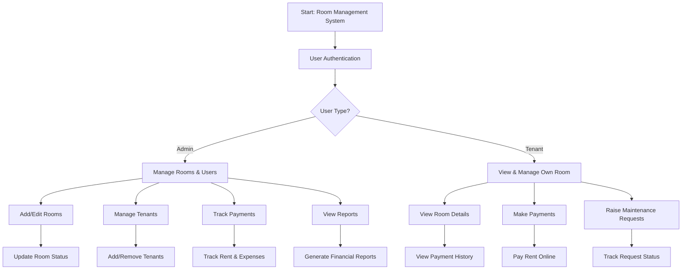

🏠 Room Management System

- User Authentication
   ===================
- Secure login for Admins and Tenants
- Role-based access control 
- Admin Features
  ==============
🛏️ Room Management
- Add / Edit / Remove rooms
- Update room status
👥 Tenant Management
- Add / Remove tenants
- Manage tenant information
💰 Financial Management
- Track payments
- Generate financial reports
- Monitor rent collection
-  Tenant Features
   ===============
🛋️ Room Information
- View room details
- Check payment history
- View transaction history
🛠️ Maintenance
- Raise maintenance requests
- Track request status
- Core Benefits
   ==============
- 📑 Digital record keeping
- 💬 Streamlined communication
- 🔍 Financial transparency

